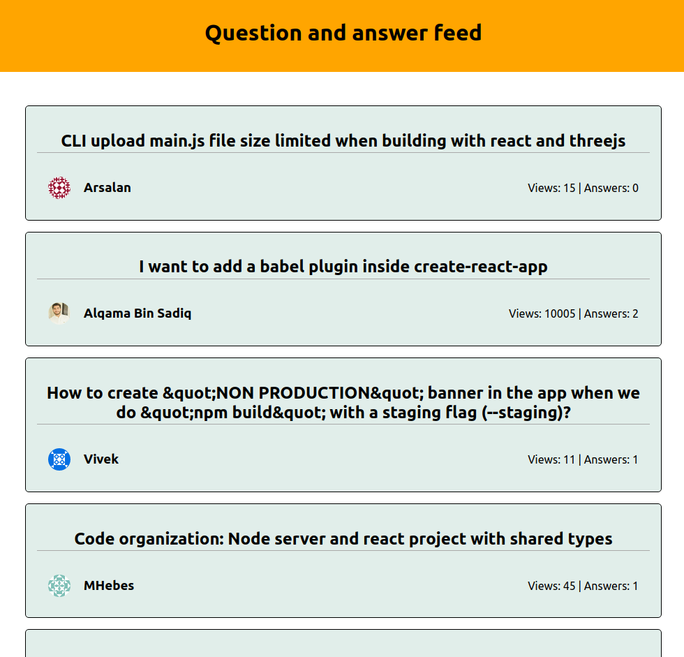

# React project
Practice react project to help me understand how 
to implement dynamic routing using react-router-dom

This app fetches data(an array of questions tagged react) from the stackoverflow api. The app then displays the data, and alows the diaplaying of each individual question using react-router

react-router also powers pagination

# Concepts used 
- React lifecycle components
- React router
- Progressive web app
- Async/Await 

# Live site
- https://lucid-johnson-91f6a4.netlify.app/

# Screenshot


# Running the app, 
you need npm installed!
Clone the project by running the command
```
git clone https://github.com/DevShasa/react-stackoverflow-feed.git
```

Navigate into the newly created folder then run the commands 
```javascript
npm install
//let npm install the packages then run
npm start 
```